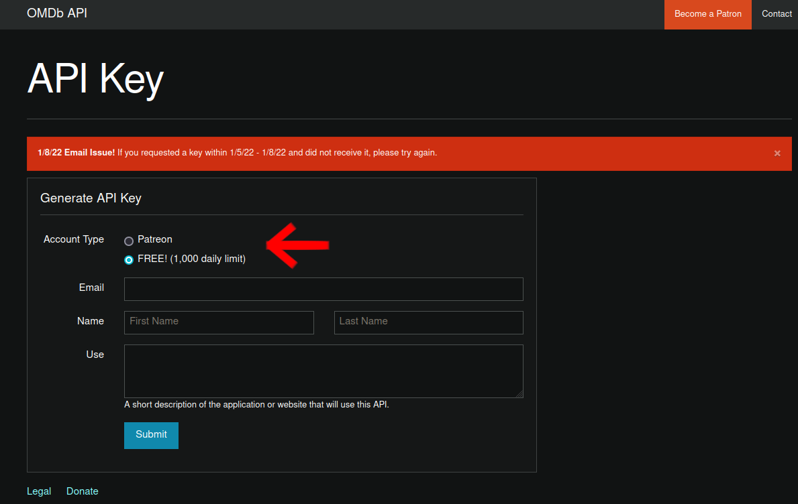

# Getting started

## Cloning this repository

In order to clone this repository, please use the following command:

    git clone https://github.com/DeutscherDude/movies-netguru-exercise.git

## Generating a new OMDB Api key

Creating a new OMDb Api key can be done under the following url: [Click me](https://www.omdbapi.com/apikey.aspx?__EVENTTARGET=freeAcct&__EVENTARGUMENT=&__LASTFOCUS=&__VIEWSTATE=%2FwEPDwUKLTIwNDY4MTIzNQ9kFgYCAQ9kFgICBw8WAh4HVmlzaWJsZWhkAgIPFgIfAGhkAgMPFgIfAGhkGAEFHl9fQ29udHJvbHNSZXF1aXJlUG9zdEJhY2tLZXlfXxYDBQtwYXRyZW9uQWNjdAUIZnJlZUFjY3QFCGZyZWVBY2N0oCxKYG7xaZwy2ktIrVmWGdWzxj%2FDhHQaAqqFYTiRTDE%3D&__VIEWSTATEGENERATOR=5E550F58&__EVENTVALIDATION=%2FwEdAAU%2BO86JjTqdg0yhuGR2tBukmSzhXfnlWWVdWIamVouVTzfZJuQDpLVS6HZFWq5fYpioiDjxFjSdCQfbG0SWduXFd8BcWGH1ot0k0SO7CfuulHLL4j%2B3qCcW3ReXhfb4KKsSs3zlQ%2B48KY6Qzm7wzZbR&at=freeAcct&Email=)

Under 'Choose account type' select 'FREE', which allows for 1000 requests per day.

Furthermore, you have to provide:

- Your e-mail address
- Name
- Surname
- Use case for the API key you are generating

## Create a '.env' file including

- MONGO_USERNAME=(Your MongoDb username)
- MONGO_PASSWORD=(Your MongoDb password)
- MONGO_URI=(Connection string)
- MONDO_DB_NAME=(name of your DB)
- MONGO_DB_PORT=(Prefered port for the MongoDB to run on)
- JWT_SECRET=(Your secret encryption key for JWT service)
- SERVER_PORT=(Prefered port for the JWT authorization service)
- APP_PORT=(Prefered port for the API service, default)
- OMDB_API_URI=http://www.omdbapi.com/?apikey
- OMDB_API_KEY=(See above for instructions on creating an OMDb API KEY)
- NODE_ENV=(Environment in which you are running the app. 'development' or else)

As a baseline, you can use the following:

    MONGO_USERNAME=Your_MongoDb_username
    MONGO_PASSWORD=Your_MongoDb_password
    MONGO_URI=Connection_string
    MONGO_DB_NAME=Name of your DB
    MONGO_DB_PORT=27017
    JWT_SECRET=Your_secret_encryption_key_for_JWT_service
    SERVER_PORT=Prefered_port_for_the_JWT_authorization_ service
    APP_PORT=Prefered_port_for_the_API_service
    OMDB_API_KEY=See_above_for_instructions_on_creating_an_OMDB_API_KEY
    OMDB_API_URI=http://www.omdbapi.com/?apikey
    NODE_ENV=development

## Running the project

To start up the project in seperate docker containers, run the following command:

    docker-compose up

To stop the project, run the following command:

    docker-compose down

**OR** press 'CTRL' + 'C'

## API methods & examples

In Postman or your HTTP Client of choice, use the following URL:

    http://localhost:5050/api/movie/

METHOD: GET

:warning: Important: Remember to pass the authorization Bearer Token

This endpoint will return you all movies created by a user passed in the Bearer Token.

    http://localhost:5050/api/movie/

METHOD: POST

:warning: Important: Remember to pass the authorization Bearer Token

BODY:

    KEY:
        title: #Title of the movie you want to look for#
